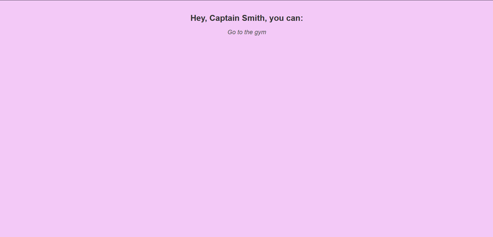

# Проект "Activity for Captain Smith"

## Инструкции по запуску проекта

1. Клонируйте репозиторий на свой компьютер.
2. Откройте файл `index.html` в любом веб-браузере.

## Описание индивидуальной работы

Этот проект создан для отображения случайной активности, которую может выполнить капитан Смит. Он использует внешний API для получения случайных активностей и отображает их на веб-странице. Проект также обновляет данные каждую минуту.

## Краткая документация к проекту

### Файлы проекта:

- `index.html`: основной HTML-файл, содержащий структуру страницы.
- `index.css`: файл стилей для оформления страницы.
- `/src/index.js`: главный JavaScript-файл, который обрабатывает логику обновления данных и отображения активности.
- `/src/activity.js`: файл, содержащий логику получения данных со стороннего сервера.

### Использование проекта:

Просто откройте файл `index.html` в вашем веб-браузере, и вы увидите случайную активность для капитана Смита.

## Примеры использования проекта

## Ответы на контрольные вопросы

1. Функция `fetch` возвращает объект Promise, который представляет собой асинхронную операцию получения ресурса по сети (например, HTTP-запрос).

2. Объект Promise представляет результат асинхронной операции и её состояние (в ожидании, выполнено успешно или выполнено с ошибкой). Он позволяет работать с асинхронными операциями в JavaScript, предоставляя удобный способ обработки результатов асинхронных вызовов и управления последовательностью операций.

3. У объекта Promise доступны следующие методы:

   - `then()`: используется для указания функции обратного вызова, которая будет выполнена при успешном выполнении операции. Метод `then()` принимает два аргумента: функцию обратного вызова для обработки успешного результата и функцию обратного вызова для обработки ошибки.
   
   - `catch()`: используется для указания функции обратного вызова, которая будет выполнена при возникновении ошибки в процессе выполнения операции.
   
   - `finally()`: используется для указания функции обратного вызова, которая будет выполнена в любом случае после завершения операции, независимо от её результата (успешного выполнения или ошибки).

## Список использованных источников

- [MDN Web Docs](https://developer.mozilla.org/)
- [Bored API](https://www.boredapi.com/)
- [Stack Overflow](https://stackoverflow.com/)

## Дополнительные важные аспекты

- Проект использует стандартные модули ECMAScript для организации кода.
- Функционал обновления данных реализован с использованием функции `setTimeout()`.
- Логика получения данных вынесена в отдельный модуль `activity.js`.
